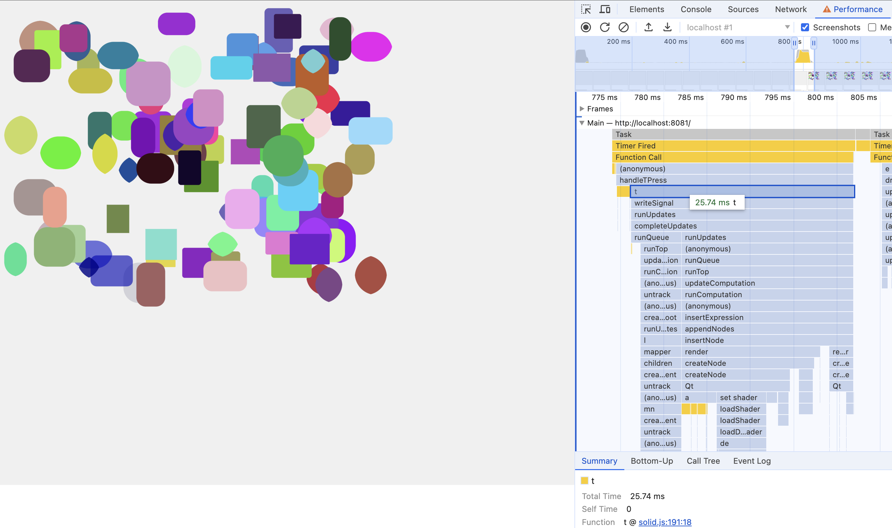
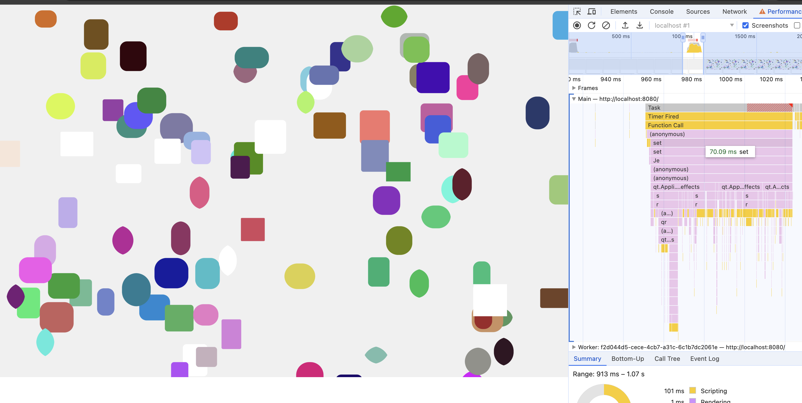
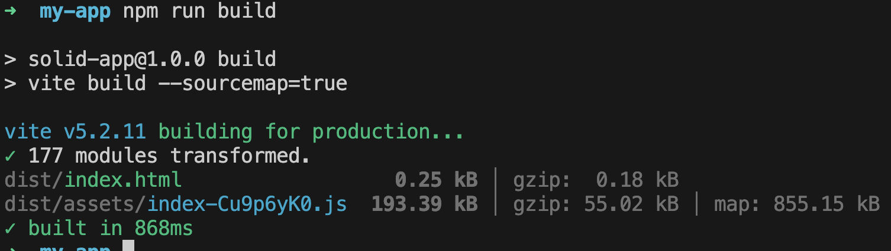
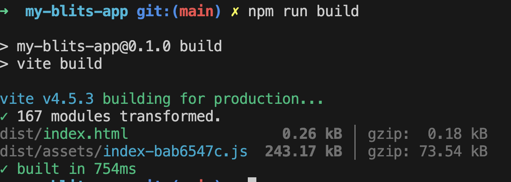
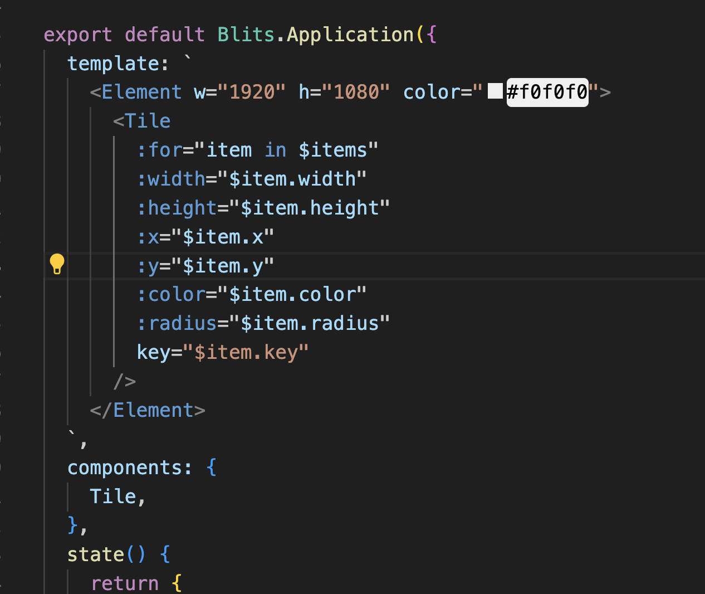
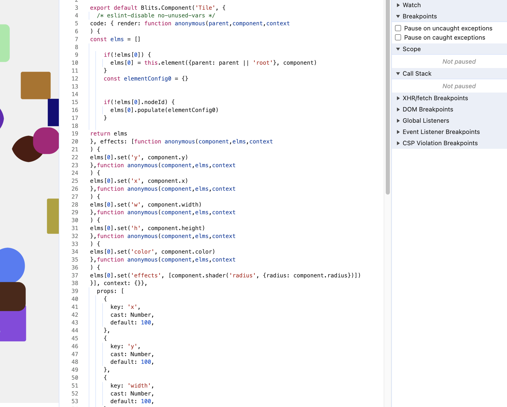
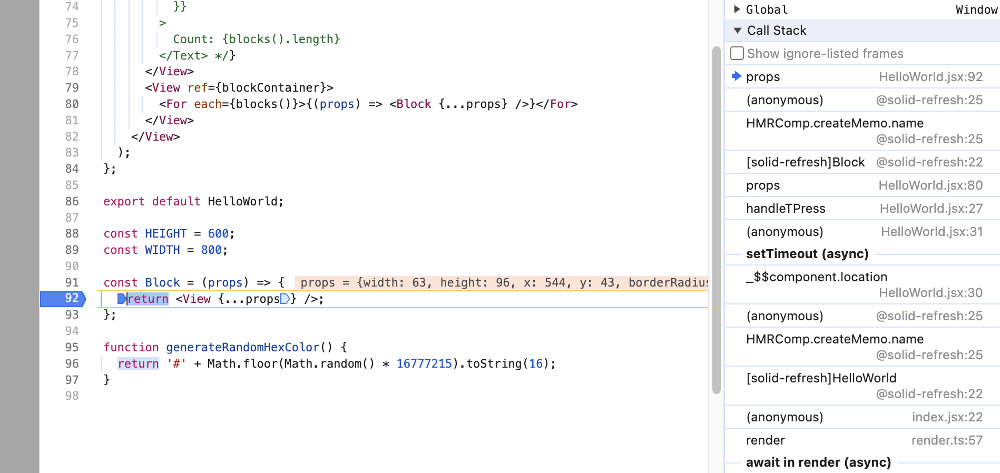

# Evaluating Lightning 3 Frameworks

Lightning 3 provides the flexibility to choose between bringing your own framework (SolidJS, Vue, or React) or utilizing the official Blits framework developed from scratch by the Core Lightning team. How should you make this decision?

## Established vs. New

Opting for a framework with a long track record means leveraging a solution that has addressed numerous challenges, enjoys robust community support, and offers extensive code samples. Typically, it's advisable to select an established framework unless the newcomer offers a fundamentally different solution, which isn't the case with Blits. Furthermore, opting for an open-source framework allows you to apply your expertise to various web projects beyond just Lightning-specific ones. Both SolidJS and Vue are well-established frameworks with ample tooling and developer resources, facilitating quick adoption. SolidJS is already operational with multiple production applications in progress, while Blits is in the beta phase, still developing features that SolidJS already offers.

## Device Compatibility

Consider the devices you need to cater to. SolidJS has been rigorously tested and confirmed to function on Chrome 49 (which introduced Proxy support) and can operate on Chrome 38 with certain limitations like avoiding splitProps. On the other hand, Blits is designed to function with Chrome 38 but hasn't been tested.

## Performance Considerations

Performance is paramount, especially on low-end devices. SolidJS boasts approximately 2 to 3 times faster performance compared to Blits, and it also offers a smaller JavaScript footprint (~10kb gzipped), leading to quicker startup times.

  <figure>
    <figcaption>Solid Random Node Creation (26ms)</figcaption>
    
  </figure>

  <figure>
    <figcaption>Blits Random Node Creation (70ms)</figcaption>
    
  </figure>

#### Bundle Size

  <figure>
    <figcaption>Solid Bundle Size (55k)</figcaption>
    
  </figure>

  <figure>
    <figcaption>Blits Bundle Size (73k)</figcaption>
    
  </figure>

## Debugging Apps

Blits does not currently offer sourcemaps for it's template code.

    
    

 
With Solid, what you write is what you debug.

    

## Other Important Features

| SolidJS                               | Blits                               |
| ------------------------------------- | ----------------------------------- |
| - Flex Layout System                  | - ???                               |
| - Template Show / If Statements       | - Known Issue (not implemented yet) |
| - Reactive Inline Text Support        | - Known Issue (not implemented yet) |
| - State Management (stores & Signals) | - Components have computed state    |
| - Typescript                          | - Definition files                  |
| - Production Ready                    | - Beta                              |
